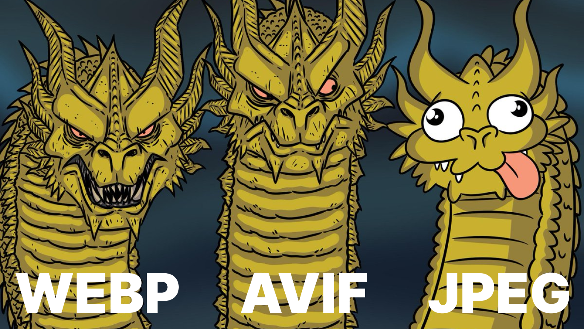

<p align="center">Module for converting Image To Avif</p>

<div align="center">
	<a href="https://pkg.go.dev/github.com/aejoy/mita">
		
	</a>
	<a href="http://www.opensource.org/licenses/MIT">
		
	</a>
    <a href="https://goreportcard.com/report/github.com/aejoy/mita">
		
	</a>
</div>

<h2 align="center">Instalation</h2>

```bash
go get github.com/aejoy/mita
```

<h2 align="center">Usage</h2>

A simple example of converting PNG to AVIF:

```go
package main

import (
	"os"
	"image"
	_ "image/png"
	_ "image/jpeg"
	"bytes"
	"github.com/aejoy/mita"
)

func main() {
	src, err := os.ReadFile(srcPath)
	if err != nil {
		panic(err)
	}

	img, _, err := image.Decode(bytes.NewReader(src))
	if err != nil {
		panic(err)
	}

	dst, err := os.Create(dstPath)
	if err != nil {
		panic(err)
	}
	defer dst.Close()

	if _, err := dst.Write(mita.Encode(img, Options{
		Quality: 75,
		Speed: 10,
	})); err != nil {
		panic(err)
	}
}